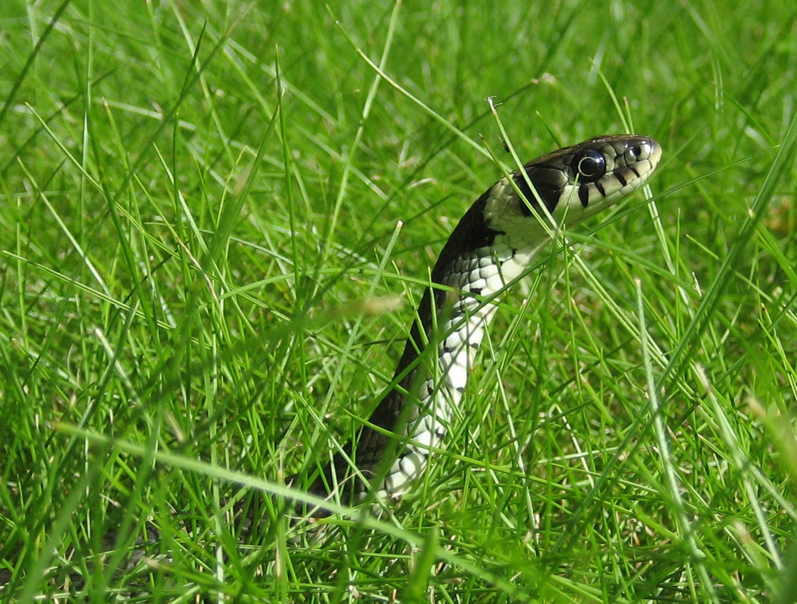
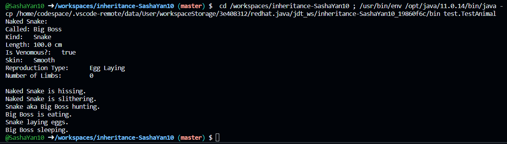

# Успадкування – Змія

### Naked Snake


### aka Big Boss


Пробачте, просто приколююсь)

## Діаграма класів:


## Код класу Animal:
```java
package domain;

public class Animal {

    public Animal() {
        this("Just an Animal", 100.00);
    }

    public Animal(String name, double length) {
        this.name = name;
        this.length = length;
    }

    protected String name;

    protected double length;

    public void eat() {
        System.out.println(name + " is eating.");
    }

    public void sound() {
        System.out.println("Naked Snake is hissing.");
    }

    public void move() {
        System.out.println("Naked Snake is slithering.");
    }

}
```

## Код класу Reptile:
```java
package domain;

public class Reptile extends Animal {

    public Reptile() {
        super("Just a Reptile", 100.00);
        kind = "Snake";
        isVenomous = true;
        skin = "Smooth";
        reproductionType = "Egg Laying";
        numberOfLimbs = 0;
    }

    public Reptile(String name, String kind, boolean isVenomous, String skin, String reproductionType,
            int numberOfLimbs) {
        super(name, 100.00);
        this.kind = kind;
        this.isVenomous = isVenomous;
        this.skin = skin;
        this.reproductionType = reproductionType;
        this.numberOfLimbs = numberOfLimbs;
    }

    protected String kind;

    protected boolean isVenomous;

    protected String skin;

    protected String reproductionType;

    protected int numberOfLimbs;

    public void sleep() {
        System.out.println(name + " sleeping.");
    }

}
```

## Код класу Snake:
```java
package domain;

public class Snake extends Reptile {

    public Snake() {
        super("Big Boss", "Snake", true, "Smooth", "Egg Laying", 0);
    }

    public Snake(String name) {
        super(name, "Snake", true, "Smooth", "Egg Laying", 0);
    }

    public void hunt() {
        System.out.println("Snake aka " + this.name + " hunting.");
    }

    public void eggLaying() {
        System.out.println("Snake laying eggs.");
    }

    public String toString() {
        return "Naked Snake: \nCalled:\t" + name + "\nKind:\t" + kind + "\nLength:\t" + length + " cm"
                + "\nIs Venomous?:\t" + isVenomous + "\nSkin:\t" + skin + "\nReproduction Type:\t" + reproductionType
                + "\nNumber of Limbs:\t" + numberOfLimbs + "\n";
    }

}
```

## Код класу TestAnimal:
```java
package test;

import domain.Snake;

public class TestAnimal {

    public static void main(String[] args) {
        Snake snake = new Snake();
        System.out.println(snake);
        snake.sound();
        snake.move();
        snake.hunt();
        snake.eat();
        snake.eggLaying();
        snake.sleep();
    }
}
```

## Результат:
